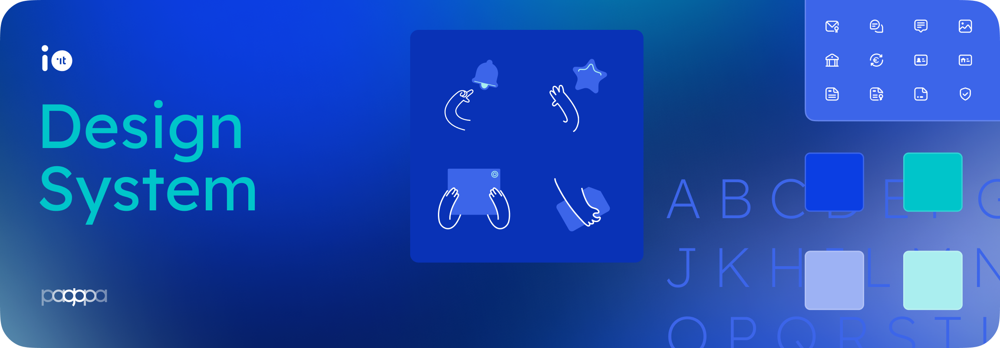

<div style="display: flex; flex-direction: column; align-items: center">
</br>
<h3 align="center" style="width: 100%">A comprehensive library of components specifically designed for the <a href="https://github.com/pagopa/io-app">IO App</a></h3>
<br />
</div>


# Getting started

## Prerequisites
To contribute to the library development, you will need to install `nodejs` and `yarn`. We recommend using [`nvm`](https://github.com/nvm-sh/nvm) to properly handle the supported nodejs version (see [`.nvmrc`](./.nvmrc)).
#### [Learn more about the `io-app` prerequisites →](https://github.com/pagopa/io-app#prerequisites)
## Installing the component library
To add the component library to the main app run:

```bash
yarn add @pagopa/io-app-design-system
```

## Launch the example app
For development purposes, a sample React Native application is included in the repository. To launch it:

```bash
# Move into `example` folder
cd example

# Install dependencies 
yarn install

# Install podfiles when targeting iOS (ignore this step for Android)
# Run this only during the first setup and when Pods dependencies change
cd iOS && bundle exec pod install

# Launch the app locally (simulator flag is optional)
yarn ios --simulator='iPhone 15 Pro'
```
Activate the toggle at the top of the application to view the experimental design system.

> [!important]
> The sample application consists of several pages with some components for testing purposes. To view the [continuously updated Design System section](https://github.com/pagopa/io-app/tree/master/ts/features/design-system), please refer to the [main app](https://github.com/pagopa/io-app).

## Playground & Documentation
A [Storybook](https://storybook.js.org/) playground is also available to help develop and test components. To start it in the local environment, run the following command:

```bash
yarn storybook
```
> [!note]
> Storybook documentation is a work in progress

# Usage
To try a component, just import it:

```tsx
import { ButtonSolid } from '@pagopa/io-app-design-system';

// [...]

const MainScreen = () => (
  <View>
    <ButtonSolid
      accessibilityLabel="Tap to trigger test alert"
      label="Hello world"
      onPress={() => Alert.alert("Alert", "Action triggered")}
    />
  </View>
);
```

# Architecture
The library is made up of several parts:

## Core
Essential core visual attributes of the design language. It includes:

- **`IOColors`**: Defines the main color palette, themes (light/dark) and other color-related utilities
- **`IOSpacing`**: Defines the main spacing scale and various component spacing attributes
- **`IOStyles`**: Defines common styles shared across components
- **`IOShapes`**: Defines visual shape-related attributes, such as radius 
- **`IOAnimations`**: Defines common animation attributes used for interactive elements (used by the [`reanimated`](https://docs.swmansion.com/react-native-reanimated/) library)
- **`IOTransitions`**: Defines reusable custom enter/exit transitions (used by the [`reanimated`](https://docs.swmansion.com/react-native-reanimated/) library)

#### [Explore the `core` folder →](./src/core)

## Foundation
Essential atomic components:
* [**Typography**](./src/components/typography/)
* **Layout**
  * [ContentWrapper](./src/components/contentWrapper/)
  * [Spacer](./src/components/spacer/) (`VSpacer`,`HSpacing`)
  * [Divider](./src/components/divider/)
* [**Icons**](./src/components/icons/): [📖 Relative docs →](./src/components/icons/)
* [**Pictograms**](./src/components/pictograms/): [📖 Relative docs →](./src/components/pictograms/)
* **Logos**
  * [Payment Logos](./src/components/logos/): [📖 Relative docs →](./src/components/logos/)
  * [Avatar](./src/components/avatar/)
* **Loaders**
  * [LoadingSpinner](./src/components/loadingSpinner/)

## Components

* [**Buttons**](./src/components/buttons/)
* [**TextInput**](./src/components/textInput/)
* [**List Items**](./src/components/listitems/)
* [**Modules**](./src/components/modules/)
* [**Badges**](./src/components/badge/) & [**Tags**](./src/components/tag/)
* **Selection**
  * [Checkbox](./src/components/checkbox/)
  * [Radio](./src/components/radio/)
  * [Switch](./src/components/switch/)
* [**Accordion**](./src/components/accordion/)
* [**Alert**](./src/components/alert/)
* **Advice & Banners**
  * [FeatureInfo](./src/components/featureInfo/)
  * [Banner](./src/components/banner/)

#### [Explore the `components` folder →](./src/components)

> [!note]
> Some components that can be tested in the [official DS section](https://github.com/pagopa/io-app/tree/master/ts/features/design-system) are missing


## Functions
Common functions used to wrap up external libraries and utilities

#### [Explore the `functions` folder →](./src/functions)

## Dependencies
* [`react-native-reanimated`](https://github.com/software-mansion/react-native-reanimated): Handles all the component animations
* [`react-native-svg`](https://github.com/software-mansion/react-native-svg): Handles all the vector asset components (icons, pictograms and logos)
* [`react-native-haptic-feedback`](https://github.com/mkuczera/react-native-haptic-feedback): Handles all the haptic feedbacks
* [`react-native-safe-area-context`](https://github.com/th3rdwave/react-native-safe-area-context): Handles all safe area spacing attributes
* [`react-native-linear-gradient`](https://github.com/react-native-linear-gradient/react-native-linear-gradient)
* [`react-native-gesture-handler`](https://github.com/software-mansion/react-native-gesture-handler)

---

## Contributing

See the [contributing guide](CONTRIBUTING.md) to learn how to contribute to the repository and the development workflow.

## License

MIT

---

Made with [create-react-native-library](https://github.com/callstack/react-native-builder-bob)
